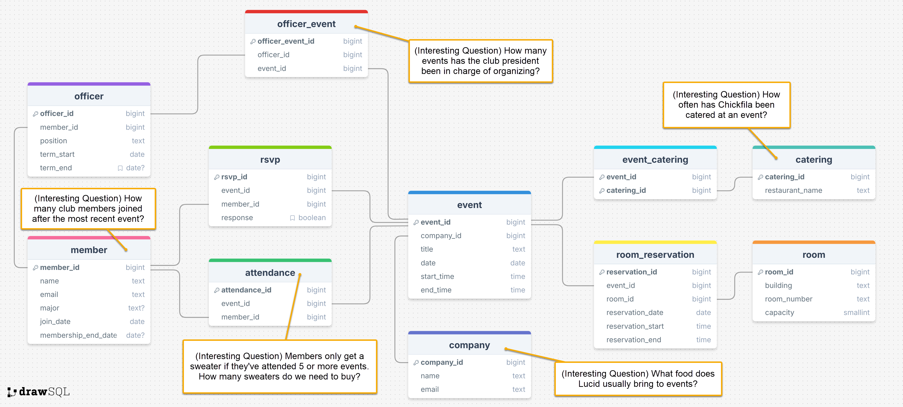

# Women in Computer Science club

My project models data that someone running the BYU Women in Computer Science club might find useful. Includes information about club members and officers, club events, companies that host club events, event catering, and relevant information about event participation.




## Query I thought it did well on

**Question**: What is being brought for food at the next event?

**GPT SQL Response**:
```sql
SELECT restaurant_name 
FROM catering
JOIN event_catering ON catering.catering_id = event_catering.catering_id 
JOIN event ON event_catering.event_id = event.event_id 
WHERE event.date = (SELECT MIN(date) FROM event WHERE date >= DATE('now'));
```

**Friendly Response**: Based on the provided query and database schema, the query was designed to retrieve the name of the restaurant providing catering for the upcoming event. However, the results returned an empty list, which indicates that there is no catering arranged (or no data recorded) for the next event in the database. Therefore, no food is currently being brought for the next event.


## Question that it tripped up on
It struggled to consistently write a correct SQL query for adding a new club member into the database. Half of the time this question would pass, the other half not. Some common errors are: (1) the string "ite" is generated before the INSERT INTO statement, throwing a syntax error. And (2) creating a new ID for the new row is commented, rather than actually written. 

Note: This is not including when the single domain double shot runs after the zero shot. When both have correct SQL queries, the second will present a UNIQUE constraint failure (email not being unique from member being added twice), which is expected behaviour. 


Question: Add a new member to the club. Her name is Catherine and her email is catherine@byu.edu

**GPT SQL Response -- from Single Domain Double Shot**:
```sql
INSERT INTO member (member_id, name, email, join_date) 
VALUES (/* next available ID */, 'Catherine', 'catherine@byu.edu', DATE('now'));
```

**Friendly response -- from Single Domain Double Shot**: 
      "friendlyResponse": "There are 7 members in the club.",
      "error": "near \",\": syntax error"

**GPT SQL Response -- from Zero Shot**:
```sql
ite
INSERT INTO member (member_id, name, email, join_date) 
VALUES ((SELECT IFNULL(MAX(member_id), 0) + 1 FROM member), 'Catherine', 'catherine@byu.edu', DATE('now'));
```

**Friendly response -- from Zero Shot**: 
      "friendlyResponse": "The club has 6 members.",
      "error": "near \"ite\": syntax error"


Reflection on error: I'm unsure how to consistently get the desired answer. Maybe a different prompting strategy would help. The success in response was variable and unpredictable. 

## Conclusion
My findings is that the AI I used performed very well for  straight-forward queries. Most questions I came up with and friends came up with were resolved. The model struggled to consistently generate accurate queries for advanced commands.